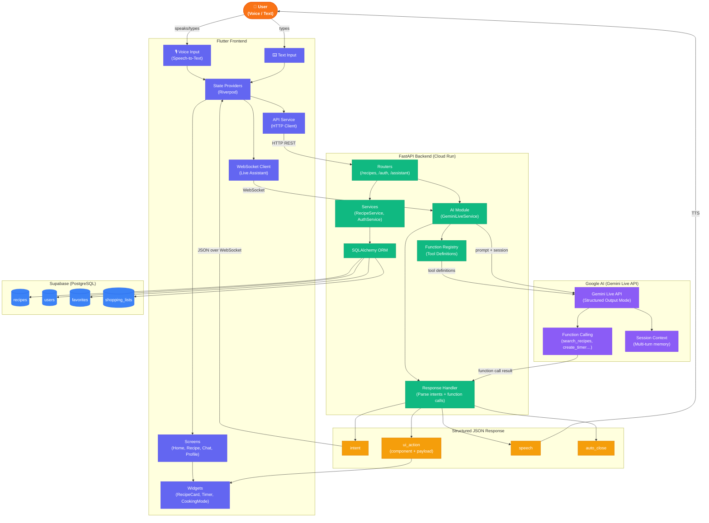
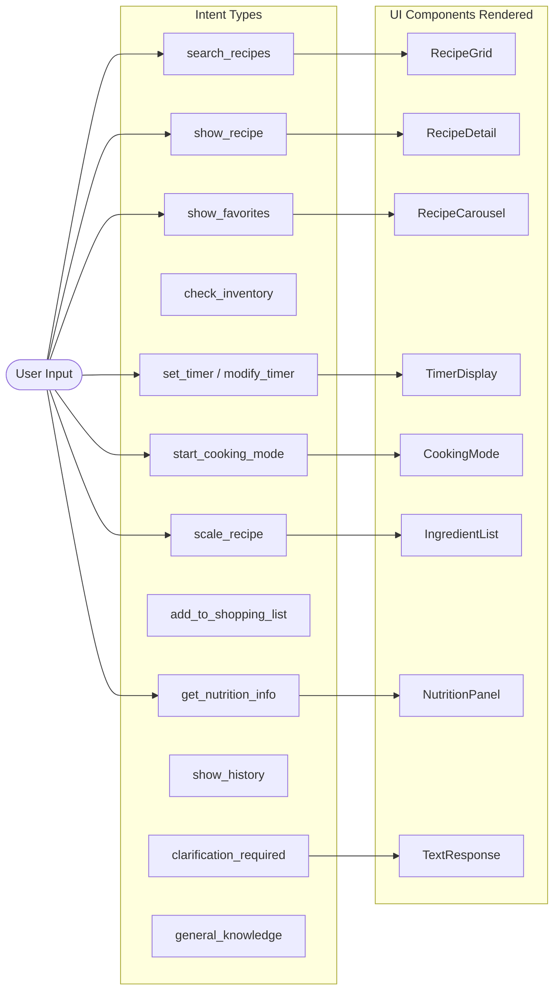
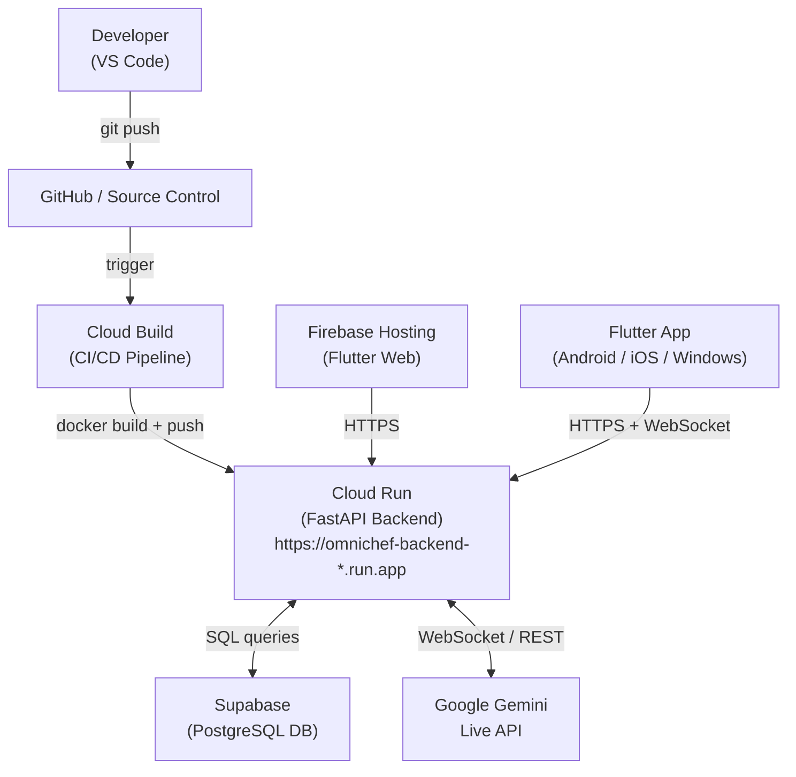

# OMNICHEF — System Architecture

## Full System Diagram

```mermaid
flowchart TD
    USER(["👤 User\n(Voice / Text)"])

    subgraph FRONTEND["Flutter Frontend"]
        direction TB
        VOICE["🎙️ Voice Input\n(Speech-to-Text)"]
        TEXT["⌨️ Text Input"]
        PROVIDERS["State Providers\n(Riverpod)"]
        SCREENS["Screens\n(Home, Recipe, Chat, Profile)"]
        WIDGETS["Widgets\n(RecipeCard, Timer, CookingMode)"]
        API_SVC["API Service\n(HTTP Client)"]
        WS["WebSocket Client\n(Live Assistant)"]
    end

    subgraph BACKEND["FastAPI Backend (Cloud Run)"]
        direction TB
        ROUTERS["Routers\n(/recipes, /auth, /assistant)"]
        SERVICES["Services\n(RecipeService, AuthService)"]
        AI_MODULE["AI Module\n(GeminiLiveService)"]
        FUNC_REG["Function Registry\n(Tool Definitions)"]
        RESP_HANDLER["Response Handler\n(Parse intents + function calls)"]
        DB_LAYER["SQLAlchemy ORM"]
    end

    subgraph AI_LAYER["Google AI (Gemini Live API)"]
        direction TB
        GEMINI["Gemini Live API\n(Structured Output Mode)"]
        TOOLS_NODE["Function Calling\n(search_recipes, create_timer…)"]
        CONTEXT["Session Context\n(Multi-turn memory)"]
    end

    subgraph DB_LAYER_EXT["Supabase (PostgreSQL)"]
        RECIPES_TBL[("recipes")]
        USERS_TBL[("users")]
        FAVS_TBL[("favorites")]
        SHOPPING_TBL[("shopping_lists")]
    end

    subgraph RESPONSE_FLOW["Structured JSON Response"]
        direction LR
        INTENT["intent"]
        UI_ACTION["ui_action\n(component + payload)"]
        SPEECH["speech"]
        AUTO_CLOSE["auto_close"]
    end

    %% User → Frontend
    USER -->|speaks/types| VOICE
    USER -->|types| TEXT
    VOICE --> PROVIDERS
    TEXT --> PROVIDERS
    PROVIDERS --> SCREENS
    SCREENS --> WIDGETS
    PROVIDERS --> API_SVC
    PROVIDERS --> WS

    %% Frontend → Backend
    API_SVC -->|HTTP REST| ROUTERS
    WS -->|WebSocket| AI_MODULE

    %% Backend internals
    ROUTERS --> SERVICES
    ROUTERS --> AI_MODULE
    SERVICES --> DB_LAYER
    AI_MODULE --> FUNC_REG
    AI_MODULE --> RESP_HANDLER

    %% Backend → Gemini
    FUNC_REG -->|tool definitions| GEMINI
    AI_MODULE -->|prompt + session| GEMINI
    GEMINI --> TOOLS_NODE
    GEMINI --> CONTEXT
    TOOLS_NODE -->|function call result| RESP_HANDLER

    %% Gemini → Structured Response
    RESP_HANDLER --> INTENT
    RESP_HANDLER --> UI_ACTION
    RESP_HANDLER --> SPEECH
    RESP_HANDLER --> AUTO_CLOSE

    %% Response → Frontend
    INTENT -->|JSON over WebSocket| PROVIDERS
    UI_ACTION --> WIDGETS
    SPEECH -->|TTS| USER

    %% DB connections
    DB_LAYER --> RECIPES_TBL
    DB_LAYER --> USERS_TBL
    DB_LAYER --> FAVS_TBL
    DB_LAYER --> SHOPPING_TBL

    %% Styling
    classDef userNode fill:#f97316,stroke:#ea580c,color:#fff,font-weight:bold
    classDef frontendNode fill:#6366f1,stroke:#4f46e5,color:#fff
    classDef backendNode fill:#10b981,stroke:#059669,color:#fff
    classDef aiNode fill:#8b5cf6,stroke:#7c3aed,color:#fff
    classDef dbNode fill:#3b82f6,stroke:#2563eb,color:#fff
    classDef responseNode fill:#f59e0b,stroke:#d97706,color:#fff

    class USER userNode
    class VOICE,TEXT,PROVIDERS,SCREENS,WIDGETS,API_SVC,WS frontendNode
    class ROUTERS,SERVICES,AI_MODULE,FUNC_REG,RESP_HANDLER,DB_LAYER backendNode
    class GEMINI,TOOLS_NODE,CONTEXT aiNode
    class RECIPES_TBL,USERS_TBL,FAVS_TBL,SHOPPING_TBL dbNode
    class INTENT,UI_ACTION,SPEECH,AUTO_CLOSE responseNode
```

---

## Intent Flow Diagram

```mermaid
flowchart LR
    INPUT(["User Input"])

    subgraph INTENTS["Intent Types"]
        Q1["search_recipes"]
        Q2["show_recipe"]
        Q3["get_nutrition_info"]
        Q4["check_inventory"]
        A1["set_timer / modify_timer"]
        A2["start_cooking_mode"]
        A3["scale_recipe"]
        A4["add_to_shopping_list"]
        N1["show_favorites"]
        N2["show_history"]
        C1["clarification_required"]
        C2["general_knowledge"]
    end

    subgraph UI_COMPONENTS["UI Components Rendered"]
        R1["RecipeGrid"]
        R2["RecipeDetail"]
        R3["RecipeCarousel"]
        R4["TimerDisplay"]
        R5["CookingMode"]
        R6["IngredientList"]
        R7["NutritionPanel"]
        R8["TextResponse"]
    end

    INPUT --> Q1 --> R1
    INPUT --> Q2 --> R2
    INPUT --> Q3 --> R7
    INPUT --> A1 --> R4
    INPUT --> A2 --> R5
    INPUT --> A3 --> R6
    INPUT --> N1 --> R3
    C1 --> R8
```

---

## Deployment Architecture

```mermaid
flowchart TD
    DEV["Developer\n(VS Code)"]
    GIT["GitHub / Source Control"]
    CB["Cloud Build\n(CI/CD Pipeline)"]
    CR["Cloud Run\n(FastAPI Backend)\nhttps://omnichef-backend-*.run.app"]
    SUPABASE["Supabase\n(PostgreSQL DB)"]
    GEMINI_API["Google Gemini\nLive API"]
    CDN["Firebase Hosting\n(Flutter Web)"]
    MOBILE["Flutter App\n(Android / iOS / Windows)"]

    DEV -->|git push| GIT
    GIT -->|trigger| CB
    CB -->|docker build + push| CR
    CR <-->|SQL queries| SUPABASE
    CR <-->|WebSocket / REST| GEMINI_API
    CDN -->|HTTPS| CR
    MOBILE -->|HTTPS + WebSocket| CR
```
